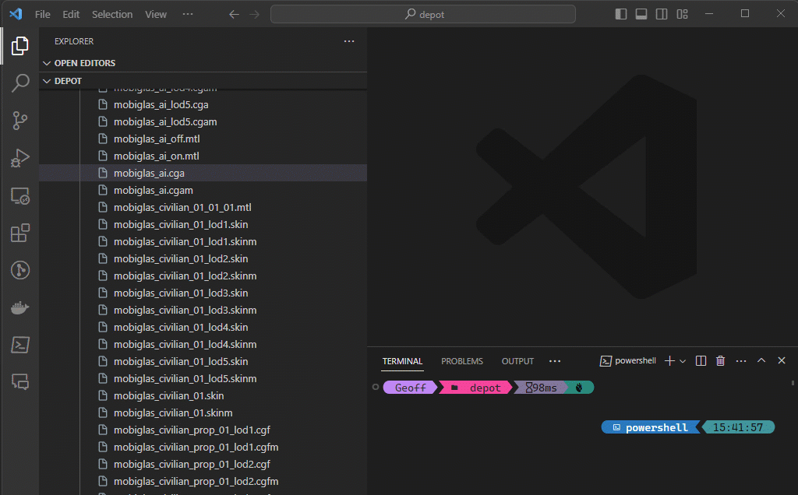

# CryXmlViewer

This VS Code extension allows you to view binary XML files from Cryengine games and other sources.  The most common of these are the material files for newer Star Citizen source files, but other Cryengine games may also use this format.  You can tell if a file is compatible as it will start with the magic string of either `CryXmlB` or `pbxml`.

## Features

This is a simple binary xml viewer that can read CryXml and pbxml files.

> Tip: Many popular extensions utilize animations. This is an excellent way to show off your extension! We recommend short, focused animations that are easy to follow.

## Requirements

None

## Extension Settings

There are no settings to be configured.

## Known Issues

There are no known issues.

## Release Notes

None

### 1.0.0

Initial release of cryxmlviewer

---

## Following extension guidelines

Ensure that you've read through the extensions guidelines and follow the best practices for creating your extension.

* [Extension Guidelines](https://code.visualstudio.com/api/references/extension-guidelines)

## For more information

* Check out the source code at https://www.github.com/markemp/cryxmlviewer

**Enjoy!**
